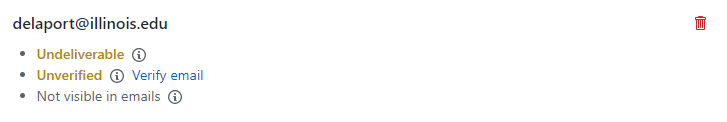

Important!: Choose the same full name and email address as you use for GitHub.
```
gpg --full-generate-key
```


```
gpg --list-secret-keys --keyid-format LONG
```

[Telling Git about your Signing Key](https://help.github.com/en/github/authenticating-to-github/telling-git-about-your-signing-key)

```
git config --global user.signingkey <<what you saw next to 'sec' earlier>>
```

```
gpg --armor --export 8B12B2C747E44BF8  
```



https://help.github.com/en/github/authenticating-to-github/signing-commits