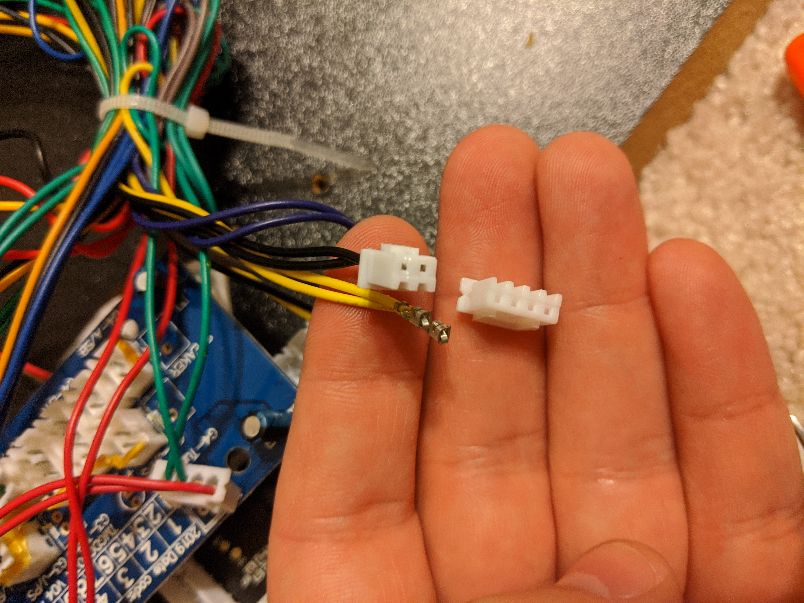
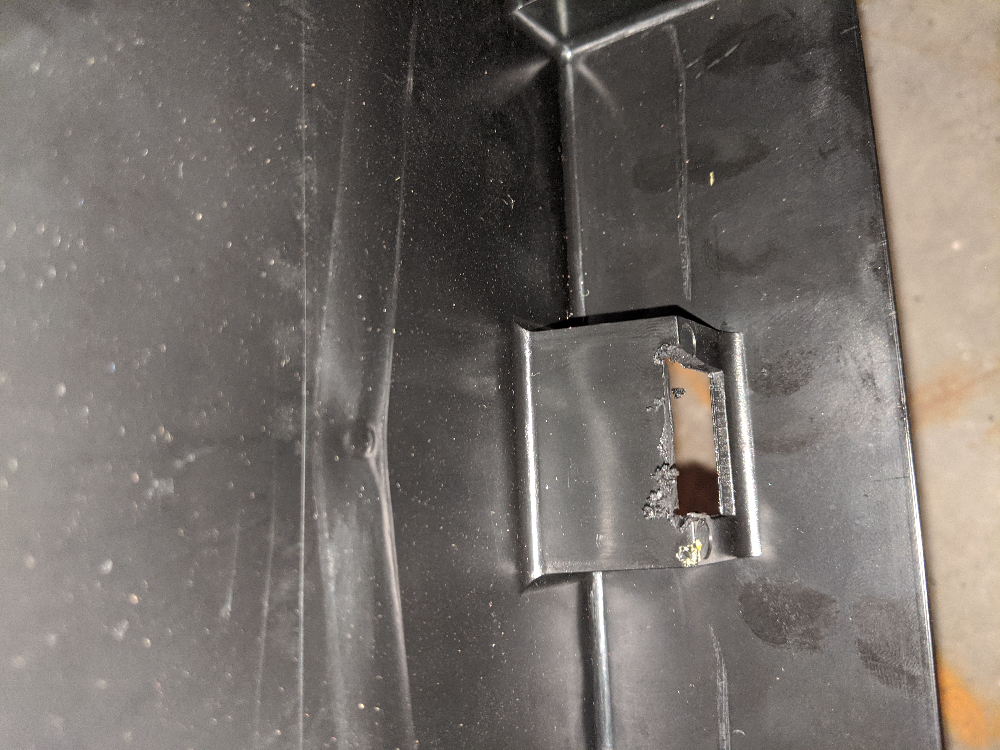

# TMNT RetroPi Conversion

## My Approach

My goal was not to have a cabinet that runs every game in existence, but rather to take a specific list of curated games I already own and move them into a stand-up side-by-side arcade cabinet experience.

I decided that one of my limits to this project is that I have chosen not to drill any new holes in the top of the cabinet. This limits the game selection to those in my collection that can be played with only one joystick and one or two buttons per player. That's still a lot of games.

I decided I was okay with drilling holes through the "J" panel on the front of the cabinet, which will allow me to reclaim all four "start" buttons on the top of the cabinet for gameplay. They are not positioned for easy reach - but most of the 3 button games I am thinking of adding only use the 3rd button sparingly - often for a rare "special" power on some kind of cool-down between uses. So I think it will work fine.

I drilled 8 holes (2 per player) in the front of the cabinet. These act as the "select" and "start" buttons that many games require to get started playing.

The heart of this build is a Raspberry Pi, but pretty much any game system that can accept 4 USB controller and output HDMI, VGA or DVI video would have worked. The chief considerations are availability of titles that do not need many buttons, and systems that do not require swapping physical media. An upgrade that would satisfy these well would be a Steam Box, which I might end up doing.

## Parts List

- 4x [Zero Delay Generic Game Controller USB][8]
- 4x ["Player" start buttons][6]
- 4x "Coin" buttons
- [Raspberry Pi Model 3][1] (Replaced almost immediately with a Model 4)
- HDMI Cable
- [Video Encoder Chip][7]
- [Sound Amplifier][2]
- 3.5mm to RCA adapter
- 3x [12 V power adapter][3] (purchased two additional, and reused the one that came with the cabinet)
- Surge protector
- [Voice Controlled Outlet][5] - because the original on/off button no longer works.
- [JST Connector Kit][4] for wiring up the additional buttons on J panel, since I had to run longer wires to reach that part of the cabinet. The kits would also have been helpful for the C panel buttons, but I managed to carefully re-use parts instead.

This USB chip allowed the existing cabinet controls to be connected to the [Raspbery Pi][1] as USB controllers. Rewiring these controls was the most time-consuming part of the project. I used four of these - one for each player (Leo, Mikey, Don and Raph).

[1]: https://smile.amazon.com/CanaKit-Raspberry-Premium-Supply-Listed/dp/B01C6EQNNK
[2]: https://smile.amazon.com/gp/product/B007TUSXEY
[3]: https://smile.amazon.com/gp/product/B07ZNJB5BB
[4]: https://smile.amazon.com/gp/product/B07D241T3M
[5]: https://smile.amazon.com/gp/product/B07B8W2KHZ
[6]: https://smile.amazon.com/gp/product/B07S31JY9M
[7]: https://smile.amazon.com/gp/product/B07ZVMWPZP
[8]: https://smile.amazon.com/gp/product/B01FZ797OC

## Wiring the Controls

+ For the buttons, I used a pliers and moved the existing JST connectors to my [USB Connectors](https://smile.amazon.com/gp/aw/d/B01FZ797OC?psc=1&ref=ppx_pop_mob_b_asin_title). In some places there was some epoxy. I dealt with it by pulling harder with the pliers. I very nearly stripped one of the wires, but it worked out.

+ For the joysticks I had to [learn how to disconnect and reconnect a JDT connector](https://youtu.be/kRvDgiX4Sk4). The joystick wires were in sets of 4, and my USB board needed sets of 2. I didn't have to pick anywhere special to put them - I just put them on the next open slot - following the usual advice to **keep every control set wired in the same order**.

+ To allow all the USB controllers wires to connect into the controls box, I used a rotary cutting tool to cut the existing plastic opening larger.

## Wiring the Screen

I used the part that gets recommended in most guides. It worked fine, except I haven't restored sound yet. It was initially not obvious to me that I had to a remove a cover on the back of the monitor, but once I did, I started finding connectors that matched up as I needed. I pretty much just plugged each wire where it fit, and it worked on the first try.

## First Configuration - Only supports 2 button games

At this point, I had only one 'select' button. I wired the cabinet on/off switch to an extra button on Leonardo's controls. This worked for awhile, but eventually the controllers were detected on boot in a different order, and then it was no longer possible to press start+select on the new player 1, because while Donatello's controller has the same mapping, it lacks an button in that position. As a work-around, I may install [this script] (https://retropie.org.uk/forum/topic/13095/controllers-order-how-swap/5). 
 
But my real intent is to drill holes in the front panel and add two more buttons per player there - which will be mapped to start and select. This will return the surface top 'add coin' buttons for use on gameplay - brining the total per player up to 3 buttons, without modifying the top of the deck in any visible way.

## Second Configuration - Supports 3 button games

By adding 8 buttons to the panel "J" on the front of the cabinet, the will free-up the 4 "start" buttons on the top of the cabinet for use during gameplay.

## Challenges

### Sound

As of this writing, I do not have sound. The Raspberry Pi outputs the sound into the HDMI signal, and the split that comes out of the video adapter is not strong enough to drive the speaker. I understand ETA Prime has a guide to solving this, and I plan to revisit.

### Power

Some people wire the external on/off and sound controls deep into the heart of the their Raspberry Pi, but as of this writing I have not bothered. To solve turning the system on and off, I purchased a voice control ready wall outlet switch. So I just tell my voice control gadget to turn the arcade on and off as needed.

## Issues after first build

+ FIXED: On/off is at surge protector. Plan is to add a voice controlled outlet.
+ FIXED: Only Leo and Donny are recognized. Plan to debug this after I have a full set of buttons. This problem went away after a reboot.
+ FIXEd: It deserves a fan and ventilation. I plan to replace the Pi model 3 with a model 4 that will come with heat sinks and a fan. - I upgraded to a Pi model 4 that came with a fan, and I have left the back off for now.
+ FIXED: Should upgrade it to a Pi4.
+ No sound. I plan to buy an amplifier. There are some good YouTube videos about this.
+ Arcade games like TMNT aren't playable without both a Coin and a Start button per player. Plan to order longer button wires and add 8 new coin and start buttons to the angled lower front panel. This keeps me from having to drill through the plastic controls case, and I will look the look better.
+ It deserves lights. I'm planning to run a simple light strip along the back of the cabinet.
+ Doesn't have enough buttons to do things like save/load or manage favorites. - I am contemplating removing the On/Off and Sound controls, and adding a small custom made button box that sits on top in the same space, and adds buttons for L/R shoulders to manage save states. I could run the wires through the On/Off button space without drilling any new holes. I might not bother as this is a Raspberry Pi specific need, and if my other plan to upgrade to a Steam Box happens first, there will be no need.