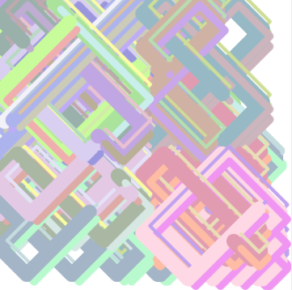

# Interactive Abstract Art

I created these using the [P5.js library][1].
Copyright Edward Delaporte 2020.

[1]: https://p5js.org/reference/

 These are works and their source code are licensed under a <a rel="license" href="http://creativecommons.org/licenses/by-sa/4.0/">Creative Commons Attribution-ShareAlike 4.0 International License</a>.

## Balls in Boxes

[Balls in Boxes](cross.html)

## Weave Pattern

[Weave Pattern](weave.html)

## Strange Weave

[Strange Weave Pattern](weave_strange.html)

